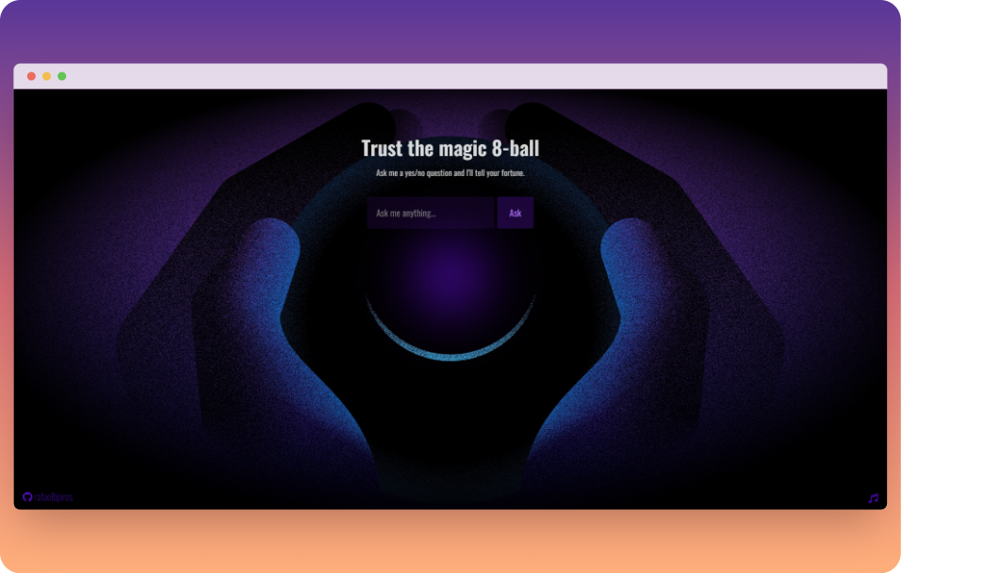

  

 

<h1 align="center">
Trust the magic 8-ball
</h1>

<a href="https://bpires.github.io/magic-8-ball/" target="_blank">Live Demo</a>
·
<a href="https://github.com/bpires/magic-8-ball/issues" target="_blank">Report Bug</a>
·
<a href="https://github.com/bpires/magic-8-ball/issues" target="_blank">Suggest Feature</a>

 

## About the project

 

    This project was inspired by the one built by <a href="https://github.com/maykbrito" target="_blank">Mayk Brito</a> during the 'Maratona Explorer' event.

  

   The event, which took place online at Rocketseat from June 6 to 12, 2022, had a fortune-telling application as its centerpiece.

Click here to access his original project: <a href="https://maykrbrito.github.io/maratona-explorer-1" target="_blank">live demo</a> | <a href="https://github.com/maykrbrito/maratona-explorer-1" target="_blank">repo</a>

 

<a href="#top">back to top</a>
 
  

## Context 

My take was to pay tribute to the iconic **magic 8-ball**, a popular device and toy invented in 1946 by **Albert C. Carter** that was used for fortune-telling or seeking advice. Albert was inspired by his mother Mary, a Cincinnati clairvoyant, who used a spirit writing device.
  
The project uses the **original 20 messages**, which include 10 affirmative responses, 5 non-committal responses, and 5 negative responses.

The Magic 8 Ball's functional component is a tube carrying a white **D20 worded dice** floating in dark coloured alcohol. When the dice floats, one of its faces is placed against the window, in a manner that its raised letters displace the dark liquid, revealing the printed message.

The pocket fortune teller device became popular in the format of a black 8 ball, used to to promote a Chicago-based billiards company in 1950. 
  
The product was later rebranded as a toy and is still available today, being considered one of the top 100 greatest toys of all-time by Time Magazine.

 

📺 **You can check the whole story behind it in this fun short video: ["Uncovering the Mystery of the Magic 8 Ball"](https://www.youtube.com/watch?v=vZRrg6Nl-1E) by Great Big Story**

 

<a href="#top">back to top</a>
 

## Assets

The background illustration was remixed from the design of Noah Jacobus ([So You Want to Be a Product Designer](https://dribbble.com/shots/5446009-So-You-Want-to-Be-a-Product-Designer/attachments/1187731?mode=media)), using [GIMP](https://www.gimp.org/).
  
A noise Texture from [PNGKIT](https://www.pngkit.com/downpic/u2w7r5u2t4e6y3a9_24-jun-2015-noise-texture-png-transparent/) was used to create an animated grainy texture based on [CSS-TRICKS](https://css-tricks.com/snippets/css/animated-grainy-texture/) & [Red Stapler](https://redstapler.co/css-film-grain-effect/) tutorials.

The dice animations were based on the [CSS Magic 8-Ball Codepen](https://codepen.io/rockhill/pen/vYdawJ) by J. James Rockhill and [Pure CSS Magic 8-ball](https://codepen.io/finnhvman/pen/wrLPJz) by Bence Szabo.

The soundtrack is an [Audacity](https://www.audacityteam.org/)-modified loop of the sample [Gloomy Eerie Horror Piano Loop](https://samplefocus.com/samples/gloomy-eerie-horror-piano-loop), by bedsheetboy.

Icons were outsourced from [Font Awesome](https://fontawesome.com/).

 

<a href="#top">back to top</a>
 
  
## Features
* [x] Animations
* [x] Ambient sound
* [ ] Mobile compatibility  
* [ ] Enhance animations 
 
#### Known bugs
* [ ] Fix text positioning and make design responsive (See issue [#1](./../../issues/1))
  
 

<a href="#top">back to top</a>
 
  
  
## Stacks

Only plain Javascript was used on this project, along with HTML & CSS.  
  

 

<a href="#top">back to top</a>
 
  
## Contributing

Contributions are what make the open source community such an amazing place to learn, be inspired, and create. Any contributions you make will be **highly appreciated**.

If you have a suggestion that would make this project better, feel free to fork the repo and create a pull request. You may also simply open an issue with the tag "enhancement".

1. Fork the project
2. Create a feature branch (`git checkout -b feature/yourFeature`)
3. Commit your changes (`git commit -m 'Add some amazing feature'`)
4. Push to the branch (`git push origin feature/yourFeature`)
5. Open a Pull Request

 

**Don't forget to give the project a star!** ⭐   

  
 
> ℹ️ **Did you know?**
> 
> In 2012, GitHub launched the starring function.
> Stars were a new way to keep track of repositories that caught your attention.
> In GitHub social etiquette, starring a repo is not only way to bookmark a project but also to express **how much you appreciated and found it interesting!**

 

<a href="#top">back to top</a>
 

  
## About me

<a href="https://discord.com/users/690807885617430558" target="_blank">
<a href="https://www.polywork.com/rafaelbpires" target="_blank">
<a href="https://bpires.hashnode.dev/" target="_blank">    
<a href="https://www.twitter.com/rafaelbpires" target="_blank">
<a href="https://www.linkedin.com/in/rafaelbpires" target="_blank">
      

  

  

  
>  
  
>
 

  

##
  

<i> I'm am an open source enthusiast.</i> 🌱
 <i>Feel free to get inspiration from any aspect of this repo! 
   Even so, be reasonable: <strong>do not just copy!</strong>
 Like academic writing, your work can incorporate the ideas of others 
 but should reflect your original approach to the problem.</i>

  
 

<a href="#top">back to top</a>
 
    
## License

Distributed under the MIT License. See [`LICENSE`](https://github.com/bpires/magic-8-ball/blob/main/LICENSE) for more information.

 
