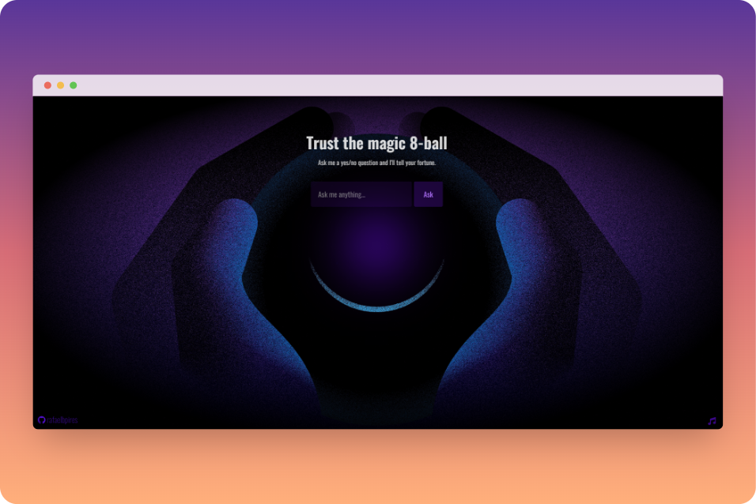

  

<h1 align="center">
  Trust the magic 8-ball
</h1>

 
 

This project was inspired by the one built by [Mayk Brito](https://github.com/maykbrito) during the 'Maratona Explorer' event, held from June 6-12, 2022 at Rocketseat. You can check the [original project here](https://maykrbrito.github.io/maratona-explorer-1/).

##

My take was to make an homage to the classic magic 8-ball, a popular device and toy invented in 1946 by Albert C. Carter, which was used for fortune-telling or seeking advice.

Albert was inspired by a spirit writing device used by his mother Mary, a Cincinnati clairvoyant.

The functional component of the Magic 8 Ball consists of a tube containing an white D20 worded dice floating in dark dyed alcohol. When the dice floats, one of its faces is pressed to the window, in a manner that its raised letters displace the blue liquid, revealing the printed message against a blue background.

The pocket fortune teller device became popular in the format of a black 8 ball, used to to promote a Chicago-based billiards company in 1950. The product was later rebranded as a toy, being sold until nowadays and is considered one of the all-time 100 greatest toys by Time Magazine.

> 📺 Check the whole story behind it in this fun short video:
> 
> ["Uncovering the Mystery of the Magic 8 Ball"](https://www.youtube.com/watch?v=vZRrg6Nl-1E) by Great Big Story

##

The project uses the original 20 messages, consisting in 10 affirmative answers, 5 non-committal answers, and 5 negative answers.

The background illustration was remixed from the design of Noah Jacobus ([So You Want to Be a Product Designer](https://dribbble.com/shots/5446009-So-You-Want-to-Be-a-Product-Designer/attachments/1187731?mode=media)), using [GIMP](https://www.gimp.org/).

I applied a noise Texture from [PNGKIT](https://www.pngkit.com/downpic/u2w7r5u2t4e6y3a9_24-jun-2015-noise-texture-png-transparent/), to get an animated grainy texture based on [CSS-TRICKS](https://css-tricks.com/snippets/css/animated-grainy-texture/) & [Red Stapler](https://redstapler.co/css-film-grain-effect/) tutorials.

The soundtrack is an adapted loop of the sample [Gloomy Eerie Horror Piano Loop](https://samplefocus.com/samples/gloomy-eerie-horror-piano-loop) by bedsheetboy, modified with [Audacity](https://www.audacityteam.org/).

I also based animations on the [CSS Magic 8-Ball Codepen](https://codepen.io/rockhill/pen/vYdawJ) by J. James Rockhill.

### Stacks

 

> ℹ️ **Did you know?**
> 
> The starring feature was introduced on GitHub in 2012. 
> Stars were a new way to keep track of repositories that you found interesting and caught your attention.
> So, in GitHub social etiquette, starring a repo is a way to bookmark a project as well as to express **how much you enjoy and find it interesting!**

 

##

<a href="https://discord.com/users/690807885617430558">
<a href="https://www.polywork.com/rafaelbpires">
<a href="https://bpires.hashnode.dev/">    
<a href="https://www.twitter.com/rafaelbpires">
<a href="https://www.linkedin.com/in/rafaelbpires">
      

  

  

  
>  
  
>
 

  

##
  

<i> I'm am an open source enthusiast.</i> 🌱
 <i>Feel free to get inspiration from any aspect of this repo! 
   Even so, be reasonable: <strong>do not just copy!</strong>
 Like academic writing, your work can incorporate the ideas of others 
 but should reflect your original approach to the problem.</i>

